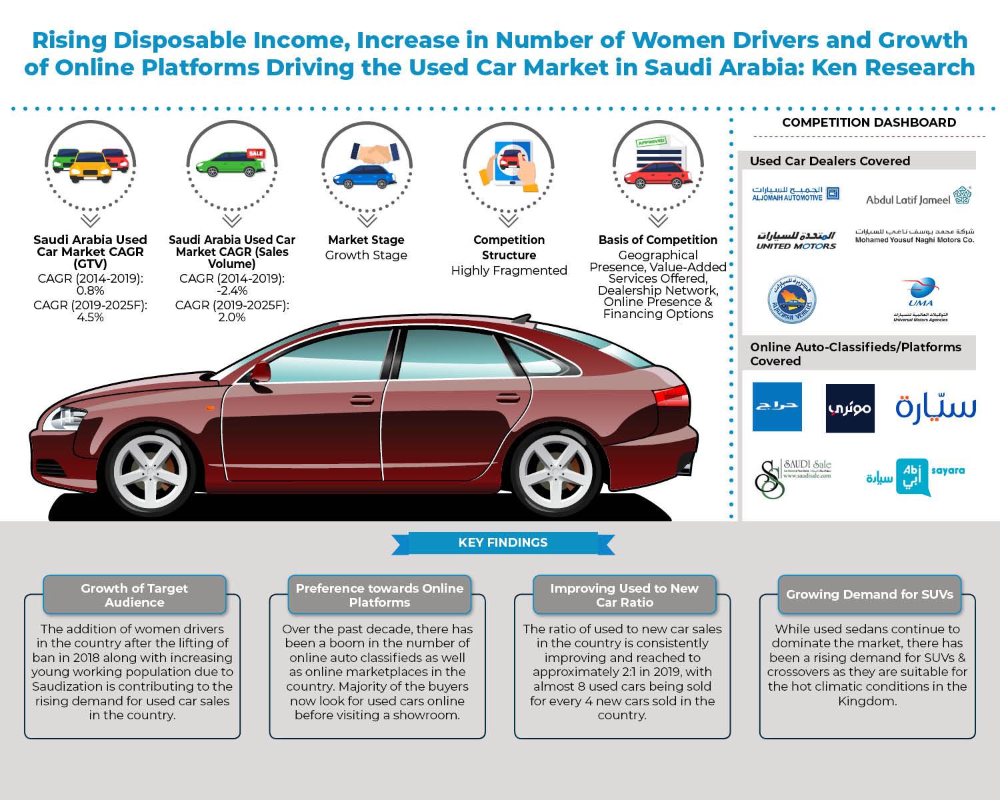
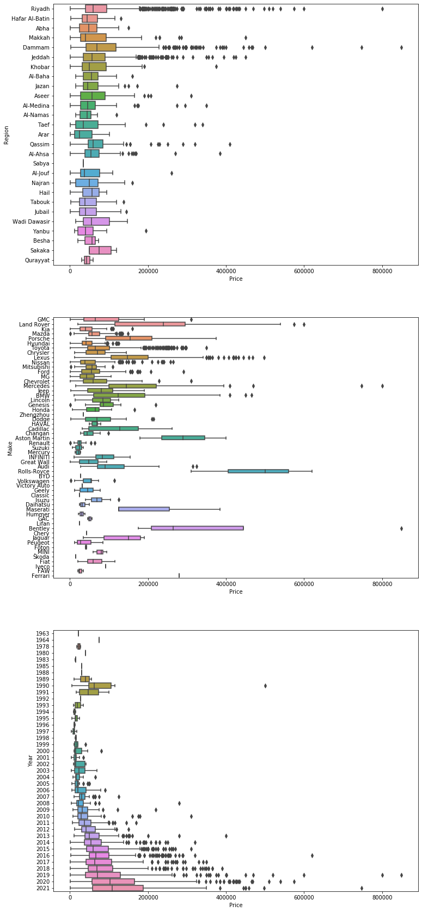
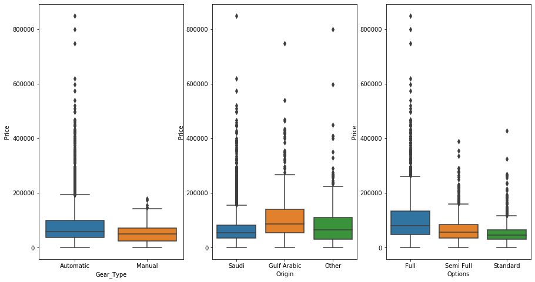
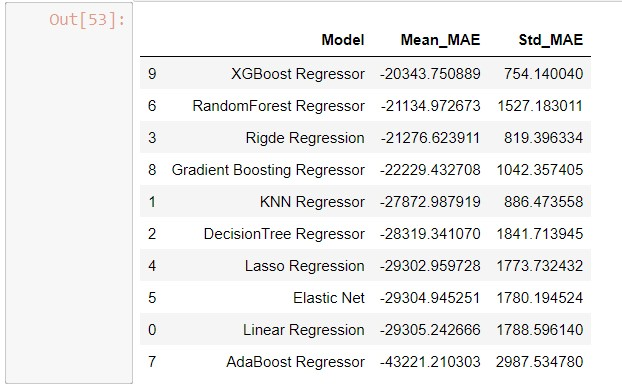
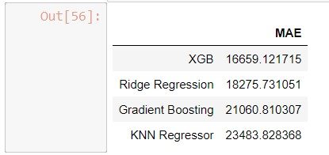
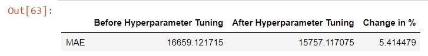
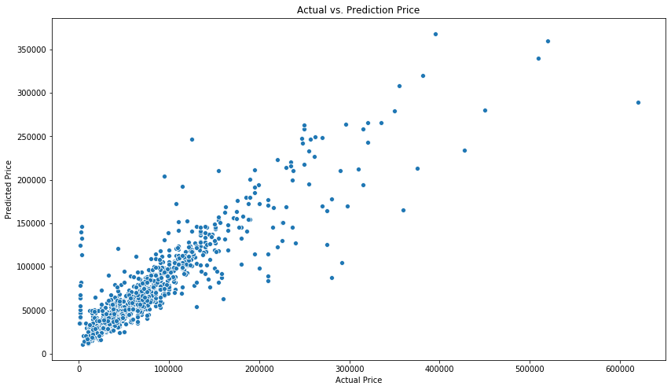
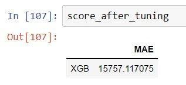

# Predicting Saudi Used Car Price using Machine Learning (Regression Model)
## Project Capstone Modul 3 Purwadhika : Machine Learning

**By: Risdan Kristori**

## Repository Structure
- <b>README.md:</b> Deskripsi Project
- <b>Project_Capstone3_Used_Car_Price_Prediction_byRisdan.ipynb:</b> Notebook Project

## Introduction
**Saudi Arabia Market Opportunity**

Kerajaan Saudi Arabia merupakan salah satu negara yang memiliki proyeksi pertumbuhan bisnis jual beli mobil bekas. Dilansir dari [kenresearch.com (Aashima Mendiratta, 2020)](https://www.kenresearch.com/automotive-transportation-and-warehousing/automotive-and-automotive-components/saudi-arabia-used-car-market-outlook-to-2025/356552-100.html#details) dengan meningkatnya pendapatan yang dapat dibelanjakan, bertambahnya jumlah supir perempuan (yang sebelumnya dilarang) dan tumbunnya pasar online jual beli mobil bekas merupakan faktor-faktor yang meningkatkan penjualan mobil bekas di negara tersebut. Di proyeksikan dari tahun 2019-2025, nilai (Gross Transaction Value) penjualan mobil bekas akan naik hingga 4.5% sedangkan volume penjualan akan meningkat hingga 2%.

Salah satu permasalahan yang sering terjadi dalam bisnis jual beli mobil bekas adalah ketidakpastian harga mobil tersebut. Hal ini menjadi masalah tidak hanya untuk pembeli tetapi juga untuk penjual mobil. Harga yang diberikan untuk mobil bekas tergantung dari berbagai macam faktor yang terkait dengan mobil itu sendiri, seperti misalnya model, tahun produksi mobil, ukuran mesin dan lain-lain. Tidak semua orang yang ingin menjual mobilnya mengetahui fluktuasi harga mobil bekas sesuai dengan spesifikasi yang dimiliki oleh mobilnya. Bagi penjual jika dia memasang harga yang terlalu tinggi yang terjadi adalah mobil tersebut tidak akan laku terjual, sebaliknya jika penjual memasang harga terlalu rendah kerugianlah yang akhirnya didapatkan. Sebaliknya bagi pembeli yang tidak memiliki pengetahuan yang memadai mengenai harga mobil akan sangat kesulitan untuk memutuskan membeli mobil bekas.

**Goals**

Membuat sebuah model yang dapat memprediksi harga mobil bekas berdasarkan spesifikasi yang dimiliki oleh mobil tersebut. Harga yang dihasilkan oleh model ini akan menjadi referensi bagi penjual dan pembeli mobil jika akan melakukan transaksi jual beli mobil bekas. Tujuannya adalah supaya penjual/ pembeli mobil bekas mengambil keputusan lebih cepat dalam melakukan transaksi (menjual/ membeli).

Matrix yang akan digunakan untuk mengevaluasi model yang akan dibuat adalah:
- Root Mean Squared Error (rmse)
- R-Squared
- Mean Absolute Error (MAE)
- Mean Absolute Percentage Error (MAPE)
- Mean Squared Log Error (MSLE)

Model ini dapat digunakan oleh platform jual beli mobil bekas online seperti Syarah.com agar pengunjung website yang ingin menjual atau membeli tidak ragu dalam menentukan harga, hal ini akan berdampak pada naiknya jumlah transaksi pada platform dan menaikkan pertumbuhan bisnis mobil bekas.

**Data Information**
- Data yang digunakan merupakan data spesifikasi/fitur mobil bekas beserta beserta harga jualnya yang telah disediakan oleh Purwadhika. Dilihat dari bentuk dan pola data, diasumsikan bahwa data ini diambil dari website Syarah.com yang menjual mobil bekas di Saudi Arabia.
- Data 'price'/harga untuk mobil bekas yang sifatnya 'negotiable' bernilai 0 (nol). Harga berdasarkan kesepakatan antara penjual dan pembeli.
- Berikut adalah rincian fitur pada data

| Attribute | Data Type| Description |
| --- | --- | --- |
| Type | Object | Type of used car |
| Region | Object | The region in which the used car was offered for sale |
| Make | Object | Name of the car company |
| Gear_Type | Object | Automatic / Manual |
| Origin | Object | Country of importer (Gulf / Saudi / Other) |
| Options | Object | Full Options / Semi-Full / Standard |
| Year | Int | Year of Manufacturing |
| Enginee_Size | Float | The engine size of used car |
| Mileage | Int | The distance that used car have travelled, measured in miles |
| Negotiable | Bool | If True, the price is 0. This means the price is negotiable (not set) |
| Price | int | Price of the used car (in SAR) |

## Exploratory Data Analysis

- Daerah yang menawarkan penjualan mobil bekas terbanyak terdapat pada kota Riyadh, Dammam dan Jeddah. Harga penjualan mobil dari beberapa daerah tersebut bervariasi dan yang memiliki median tertinggi yaitu dari Kota Dammam dan Sakaka. Secara keseluruhan harga mobil tidak terlalu terpengaruh oleh daerahnya berasal.
- Produsen mobil bekas terbanyak yang ditawarkan adalah dari Toyota, Hyundai dan Ford. Sedangkan median harga tertinggi adalah mobil buatan Rolls-Royce, Aston Martin dan Bentley. Mobil buatan Land Rover memiliki rentang harga yang paling tinggi, diikuti dengan mobil buatan dari Porche, Mercedes, BMW, Lexus dan lainnya. Dapat dilihat melalui boxplot bahwa produsen mobil cukup berpengaruh terhadap harga mobil, contohnya mobil-mobil dengan produsen Rolls-Royce, Aston Martin dan Bentley merupakan jenis mobil mewah yang membuat harganya tinggi.
- Mobil yang dijual paling banyak merupakan mobil yang di produksi di Tahun 2015-2019. Median harga untuk mobil dari tahun 1994 mengalami tren kenaikan hingga tahun 2021. Beberapa mobil dibawah tahun 1994 memiliki harga yang cukup tinggi

- Mobil bekas dengan Gear_Type tipe 'Automatic' lebih banyak dari pada mobil bekas dengan Gear_Type 'Manual'. Harga yang ditawarkan lebih bervariasi mobil 'Automatic' dan lebih tinggi mediannya daripada mobil 'Manual'.
- 'Saudi' merupakan importir mobil dengan jumlah terbanyak, sedangkan mobil yang di impor oleh Gulf Arabic memiliki median harga yang tertinggi, diikuti oleh daerah lain ('Other') dan 'Saudi'.
- Mobil bekas dengan Options 'Full' memiliki jumlah yang paling banyak tetapi tidak signifikan. Harga mobil bekas dengan Options Full adalah yang tertinggi, diikuti dengan 'Semi Full' dan 'Standard'.

## Modeling

**Feature Engineering**

Sebelum dilakukan modeling terdapat beberapa fitur kategorikal yang dilakukan encoding kemudian scaling sebagai berikut.

| Encoding | Feature|
| --- | --- |
| One Hot Encoding | 'Gear_Type', 'Origin', 'Options' |
| Binary Encoding | 'Type', 'Make','Region' |

Kemudian barulah semua fiture dilakukan standar scaling.

**Modeling**

Model yang akan digunakan untuk memprediksi nilai Price disini ada 10, terdiri dari 6 base model dan 4 model ensemble, yang kemudian dipilih salah satu model terbaik. Model tersebut adalah:

Base Model:

1. Linear Regression
2. KNN Regressor
3. Decision Tree Regressor
4. Rigde Regression
5. Lasso Regression
6. Elastic Net

Ensemble Model:

1. Random Forest Regressor
2. Ada Boost Regressor
3. Gradient Boosting Regressor
4. Xtreme Gradient Boosting Regessor

Evaluasi menggunakan matrix **Mean Absolute Error** dikarenakan masih terdapat banyak nilai outlier pada data.

Berikut adalah hasil evaluasi terhadap semua model terhadap **data train**.

Berdasarkan hasil uji terhadap data test diatas, didapatkan bahwa model Xtreme Gradient Boosting memiliki score matrix yang terbaik, selanjutnya dilakukan hyperparameter tuning terhadap parameter tersebut menggunakan hasil evaluasi terhadap **data test**.

Dari tabel diatas dapat dilihat bahwa nilai metrik MAE perbaikan (5.4%), sehingga digunakan parameter hasil dari tuning.

## Result

Grafik dibawah adalah grafik perbandingan antara nilai aktual Price dengan nilai hasil prediksi dengan menggunakan model Extreme Gradient Boosting dengan parameter yang telah di tuning. Dari grafik diatas beberapa hal yang dapat ditemukan sebagai berikut.

Pemodelan sudah cukup baik dan linear, dapat dilihat dari grafik dengan bentuk yang hampir linear dan nilai metrik error yang kecil.
Beberapa nilai aktual price yang kecil diatas jika dibandingkan dengan predicted value-nya mengalami error yang cukup banyak, hal ini dikarenakan banyaknya data dengan nilai Price yang kecil. Hal ini dapat menjadi masukan untuk pemodelan kedepannya agar memberikan batas yang lebih tinggi untuk minimal nilai Price.
Secara umum model sudah cukup baik berdasarkan matrik evaluasi dan grafik diatas. Berikut adalah parameter-parameter yang sangat berpengaruh terhadap penentuan nilai Price pada model.

## Conclusion

Nilai MAE menceritakan bahwa besaran harga Price yang diprediksi dapat memiliki selisih dengan nilai sebenarnya (+-) 15757 SAR (MAE). Untuk mobil bekas dengan harga yang tinggi (maks Price 850000 SAR) maka nilai error yang dihasilkan (RMSE dan MAE) akan terlihat kecil (1.8%), tetapi untuk mobil bekas dengan harga yang rendah (min Price 500 SAR) nilai error akan sangat besar. Oleh karena itu model ini masih ditingkatkan dengan memberikan batasan nilai minimum yang lebih tinggi pada data Price.

Secara keseluruhan model ini cukup baik untuk memprediksi harga mobil bekas, baik untuk penjual mobil maupun untuk pembeli mobil bekas. Model ini misalnya dapat digunakan oleh website Syarah.com yang menjual mobil bekas sehingga pengunjung website dapat memperkirakan harga jual/beli mobil yang diminatinya dan menaikkan jumlah traksaksi yang terdapat di website tersebut.

## Recomendation

Rekomendasi yang dapat diberikan kedepannya untuk membuat pemodelan yang lebih baik adalah:

1. Memberikan batasan minimum nilai price yang lebih tinggi, dikarenakan terdapat beberapa error yang besar untuk nilai prediksi Price dengan harga yang rendah. Atau dapat juga dengan memecah model menjadi 2 jenis untuk harga tinggi dan harga rendah dengan masing-masing model yang berbeda.
2. Menganalisa kolinearitas fitur-fitur yang digunakan dalam modeling dengan menghitung besaran VIF masing-masing fitur, diharapkan didapatkan model yang lebih baik dengan mengeliminasi fitur yang saling berkorelasi.
3. Menggunakan motode polinomial pada fitur agar didapatkan model yang lebih sensitif.
